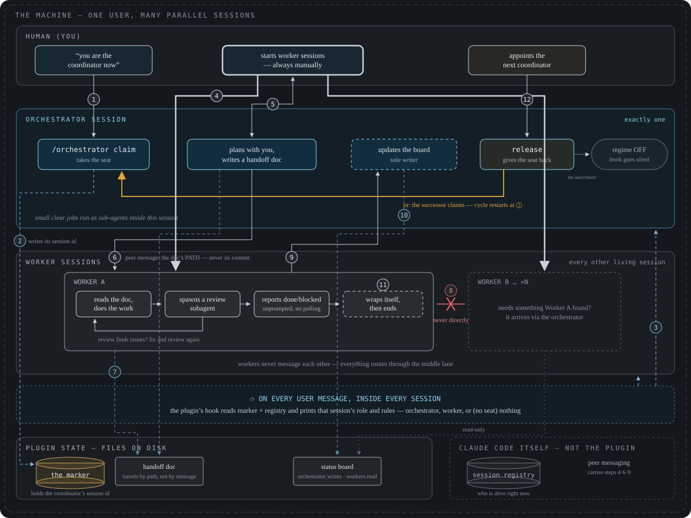

# middle-management — a Claude Code plugin for many parallel sessions on one machine

*It doesn't do the work. It makes sure the work gets done.*

Run several Claude Code sessions side by side without them stepping on each other:
exactly **one coordinator** session plans and routes, every other session works and
reports back; implementation happens in **per-topic git worktrees** instead of a shared
checkout; and **blanket git staging** (`git add -A`) is blocked so sessions cannot
commit each other's work. The regime was extracted from a production multi-session
setup; this plugin packages it so installing it is two commands and requires **no
edits to your `settings.json` or `CLAUDE.md`**.

## The picture


The picture says *middle manager*; the commands say `orchestrator` (`/orchestrator claim`).
Same tab. How the plugin knows who is who (marker file, session registry, hand-over) is
drawn in detail under [How the roles work](#how-the-roles-work).

## Install

```
/plugin marketplace add manuel-bopp/claude-middle-management
/plugin install middle-management@dr-bopp
```

Then start a new session (or run `/reload-plugins`) so the hooks arm, and run
`/middle-management-setup` once to configure the optional worktree part.

**Installed from `bopp-plugins` before?** The marketplace is now called `dr-bopp`, and a
rename migrates nothing — re-register it once:

```
/plugin uninstall middle-management@bopp-plugins
/plugin marketplace remove bopp-plugins
/plugin marketplace add manuel-bopp/claude-middle-management
/plugin install middle-management@dr-bopp
```

**After every plugin update, re-run `/middle-management-setup` step 5** if you installed the
heartbeat — its units run a copy of the scripts, because the plugin's own cache path is
versioned and goes stale with each update.

## What you get

| Piece | Kind | What it does |
|---|---|---|
| Session roles | UserPromptSubmit hook | Tells every session, on every message, whether it is the ORCHESTRATOR or a WORKER — including the operative rules for that role. Silent when no coordinator exists. |
| `/orchestrator claim\|release\|status` | command | Appoints this session as coordinator (marker file), hands the seat back, or shows who holds it. |
| Worktree guard | PreToolUse hook | Denies direct edits inside configured main checkouts and points to the worktree workflow instead. Dormant until you configure repos. |
| `/wt <name> new\|list\|done` | command | Creates/lists/removes per-topic worktrees with the branch based on your configured base branch, deps installed. `done` refuses while the worktree is dirty, unpushed or your own shell sits inside it, and deletes the branch (via `update-ref`, recording the tip) once it is merged into the base. |
| Staging guard | PreToolUse hook | Blocks `git add -A` / `git add .` / `git commit -a` so parallel sessions stage only their own files. Off-switch for solo users: `surgicalStaging: false`. |
| `/middle-management-setup` | command | Shows the current config, then interviews you and writes/edits it — with validation. |
| `middle-management` skill | skill | Extended reference: appointment, handover between sessions, troubleshooting. |
| `morning-ritual` skill | skill | The coordinator’s day-opener: messages delta, repo state, wrap audit, board sweep, machine cleanup, day plan. Coordinator sessions only; carries CUSTOMIZE markers for your team’s stack. |
| Heartbeat | systemd user timer (optional, Linux) | Watches the coordinator session: a turn with no answer for 45 minutes → one alarm through your `notifyCommand` and a poke written into the session's own socket (no model call), hourly, giving up after 24 h. Installed by setup step 5. |

## How the roles work



1. Your user tells one session "you are the coordinator"; that session runs
   `/orchestrator claim`, which records its session id in
   `<config-dir>/state/orchestrator`.
2. On every user message, the role hook reads that marker plus Claude Code's live
   session registry and announces the session's role with its contract. Workers talk
   ONLY to the coordinator; the coordinator plans, routes, and does not build.
3. `release` (in the coordinating session) turns the regime off; with no living
   coordinator the hook is silent and every session works standalone. When the
   coordinating session is gone, any session clears the orphaned marker with
   `release <id>` (the id from `status`) — never without it.
4. Terminal fallback without the marker: start a session named `orchestrator`
   (`claude -n orchestrator`) — a living session whose name starts with `orch` counts.

Solo user with a single session? You do not need `claim` at all — install, configure
the worktree part if you like it, and ignore the roles.

## Configuration

One user-global file, `<config-dir>/middle-management.json` (config dir =
`$CLAUDE_CONFIG_DIR` or `~/.claude`), written for you by `/middle-management-setup`:

```json
{
  "board": "/abs/path/to/your-status-board.md",
  "surgicalStaging": true,
  "notifyCommand": ". ~/.claude/secrets/telegram.env && curl -sS -m 15 -X POST \"https://api.telegram.org/bot$BOT_TOKEN/sendMessage\" --data-urlencode \"chat_id=$CHAT_ID\" --data-urlencode \"text=$1\"",
  "protectedCheckouts": [
    { "name": "app",
      "root": "/home/you/code/app",
      "base": "origin/dev",
      "install": "npm install",
      "worktreeDir": "/home/you/code/.worktrees-app" }
  ]
}
```

- `board` (optional): a status/waiting board only the coordinator writes; workers read.
- `notifyCommand` (optional): a shell command that reaches you when you are away from the
  keyboard — the ONE sender on the machine. The heartbeat, the unit-failure alarm and the
  coordinator itself run it with the message as `$1` and on stdin. Callers always pass plain
  text; any decoration (a bold first line, a parse mode, the fallback to plain when the rich
  form is rejected) lives inside this one command, so an alarm never dies of formatting. Keep
  tokens in a mode-600 env file the command sources — setup prints this file back to you.
- `protectedCheckouts` (optional): repos whose main checkout is edit-protected;
  work happens in worktrees under `worktreeDir`. `base` is the branch new worktree
  branches start from — setup always writes it explicitly.
- No config file = roles-only mode; the worktree part stays completely silent.
- User-global on purpose: the coordinator seat is per machine, and protected checkouts
  are absolute paths independent of any one project. One board per machine for now.

## Failure policy (loud, not silent)

If `jq` is missing, the session registry is absent, the config file is invalid, or an
override marker was left behind, the role hook says so **on every message** — the
plugin never degrades silently. While the config is invalid, the worktree guard and
`/wt` are disarmed (announced) and the staging guard is forced ON.

## Honesty notes

- The worktree guard is a **guardrail, not a security boundary**: it intercepts the
  Edit/Write tools, not Bash-side writes (`sed -i`, redirects, `git checkout`).
- The staging guard's escape hatch: only when your user explicitly allows a direct
  main-checkout edit in the session, the deny message names an override marker;
  delete the marker right after — the role hook nags while it exists.
- Hooks **auto-update** with the marketplace by default. After an update, restart open
  sessions. If a broken update worries you, disable auto-update for this marketplace.
- Command names `/wt`, `/orchestrator` are short and generic; collision behavior with
  same-named commands from other plugins is untested.
- Uninstall (`/plugin uninstall middle-management`) removes the plugin but NOT your data:
  `<config-dir>/middle-management.json` and `<config-dir>/state/{orchestrator,allow-main-checkout-edits}`
  stay; delete them by hand if you want a clean slate. The heartbeat, if installed, keeps
  running from its copy — disarm and uninstall it per the skill.
- The heartbeat's units point at a COPY under `<config-dir>/middle-management-heartbeat/`
  (the plugin cache path is versioned and would go stale on the next update): **after a
  plugin update, re-run setup step 5** to refresh that copy. `last-tick` under
  `<config-dir>/state/orch-heartbeat/` older than 15 minutes means the timer is not running.
- The heartbeat's alarm is the proven half; the poke is a cheap bet — a socket write is
  known to re-trigger an idle session, not yet known to revive one whose turn died.

## Requirements

- Claude Code recent enough to have the session registry (`<config-dir>/sessions/`)
  and cross-session peer messaging — the substrate the roles ride on.
- `jq`, `bash`, POSIX `ps`/`kill`. Linux tested; macOS expected-compatible but
  untested; Windows via WSL.
- For the heartbeat only: Linux with a systemd user manager (`loginctl enable-linger`),
  `python3`, GNU `date`. macOS launchd is not supported.
- For a private marketplace repo: working git credentials for the host on every
  installing machine (`/plugin marketplace add` clones over git).

## Recommended settings (your user-scope `settings.json` — the plugin never writes it)

- `"env": { "CLAUDE_CODE_RETRY_WATCHDOG": "1" }` — long-running coordinator and worker
  sessions keep retrying on API overload (429/529) instead of giving up after ten
  attempts. Sessions started before the change keep the old behaviour until restarted.
- `"remoteControlAtStartup": false` — with many sessions on one machine, only the
  coordinator should be reachable remotely; `claim` reminds it to turn Remote Control on
  in its tab, and a fresh coordinator starts as `claude --rc -n orchestrator`.

## Why this exists

Many parallel sessions on one machine kept messaging each other crosswise, turning
the human into a context courier, committing each other's files, and editing a shared
checkout underneath a running dev server. The fix that stuck: one coordinator session
with the only pen for the board, per-topic worktrees with one branch and one small PR
per lane, and surgical staging. This plugin is that setup, made portable.

## License

Public domain ([Unlicense](https://unlicense.org)) — do whatever you want with it.
